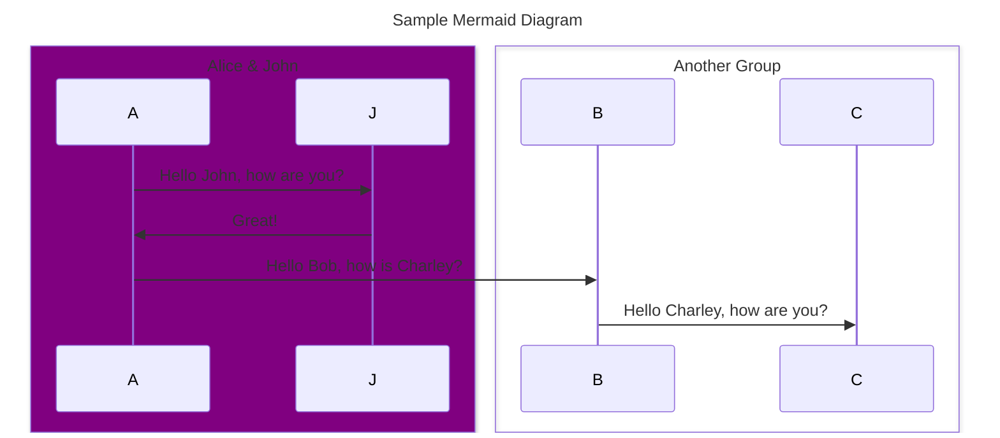

# Software Architecture Documentation Template&nbsp;

You can access the generated documentation [here (demo)](https://dassiorleando.github.io/software-architecture-documentation-template/), it's based on a sample you can download at [arc42.org](https://arc42.org/download).

<!--- this diagram will show in GitHub-like Markdown viewer -->

## Capabilities

* `Arc42` - the documentation template in place, [link](https://arc42.org/).
* `Mermaid` - used for diagramming to better illustrate your software architecture, [link](https://mermaid.js.org/).
* `C4 Model` - For context and container representation of your systems, [link](https://c4model.com/).
* `Mkdocs  Material` - is being used as the static site generator along with the material template, [link](https://squidfunk.github.io/mkdocs-material/).
* `GitHub Action` - CI/CD in place to deploy the documentation as a GitHub Page site.

## Commands

* `pip install -r requirements.txt` - install the dependencies.
* `mkdocs serve` - Start the live-reloading docs server.
* `mkdocs build` - Build the documentation site.
* `mkdocs -h` - Print help message and exit.

## Project layout

    mkdocs.yml    # The configuration file.
    docs/
        index.md  # The documentation homepage.
        diagrams  # Folder containing your Mermaid and C4 diagrams.
        decisions # The location of your architecture decisions records.
        images    # Images displayed in the pages.
        css/js    # To be used only if you need to customize the site.
        .github   # GitHub Action CI/CD pipeline.
        ...       # Other markdown pages, images and other files.

## TODO

- [x] Fix the GitHub Page link.
- [ ] Generate a PDF version of the software architecture documentation.
